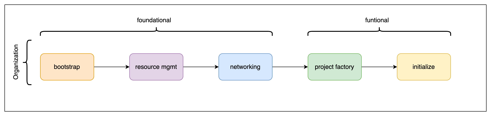

# SCA-Infrastructure
## A hub-and-spoke and security infrastructure into GCP.
Setting up a production-ready GCP organization is often a time-consuming process. This design aims to speed up this process via two complementary goals. On the one hand, this infrastructure configures a GCP organization that includes the typical elements enterprise customers require. Secondly, we provide a reference implementation of this infrastructure design using Terraform.
## Guiding principles

### Stage-by-Stage

This infrastructure uses the concept of stages, which individually perform precise tasks but, taken together, build a functional, ready-to-use GCP organization. More importantly, stages are modeled around the security boundaries that typically appear in mature organizations. This arrangement allows delegating ownership of each stage to the team responsible for the types of resources it manages. For example, as its name suggests, the networking stage sets up all the networking elements and is usually the responsibility of a dedicated networking team within the organization.

Stages also work as contacts or interfaces, defining a set of prerequisites and inputs required to perform their designed task and generating outputs needed by other stages lower in the chain. The diagram below shows the relationships between stages.

  

Please refer to the [stages](./stages/) section for further details on each stage.
### Security-first design

Security was, from the beginning, one of the most critical elements in the design. Many of this infrastructure's design decisions aim to build the foundations of a secure organization. The first two stages deal mainly with the organization-wide security setup.

This infrastructure also aims to minimize the number of permissions granted to principals according to the security-first approach previously mentioned. We achieve this through the meticulous use of groups, service accounts, custom roles, and [Cloud IAM Conditions](https://cloud.google.com/iam/docs/conditions-overview), among other things.

### Migrate this infrastructure to Azure

This mindset can use in every Cloud Provider, specially is Azure, you can use some the following suggestion about alternative service and resource in Azure should use for this infrastructure:

| GCP | Azure |
|-----|-------|
|Compute Instance|Virtual Machine|
|Project|Subscription|
|Organization|Management Group|
|Artifactory Registry|Azure Artifacts|
|Cloud NAT|Azure Virtual Network NAT|
|Cloud DNS|Azure DNS|
|VPC Peering|Virtual Network Peering|
|GKE|Azure Kubernetes Service (AKS)|
|Layer 7 Load Balancer|Application Gateway|
|Organization Policies|Azure Policy|
|Firewall Rules|Network Security Groups|