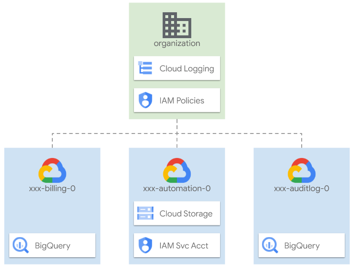

# Organization bootstrap

The primary purpose of this stage is to enable critical organization-level functionalities that depend on broad administrative permissions, and prepare the prerequisites needed to enable automation in this and future stages.

It is intentionally simple, to minimize usage of administrative-level permissions and enable simple auditing and troubleshooting, and only deals with three sets of resources:

- project, service accounts, and GCS buckets for automation
- projects, BQ datasets, and sinks for audit log and billing exports
- IAM bindings on the organization

Use the following diagram as a simple high level reference for the following sections, which describe the stage and its possible customizations in detail.

  

## Design overview and choices

As mentioned above, this stage only does the bare minimum required to bootstrap automation, and ensure that base audit and billing exports are in place from the start to provide some measure of accountability, even before the security configurations are applied in a later stage.

It also sets up organization-level IAM bindings so the Organization Administrator role is only used here, trading off some design freedom for ease of auditing and troubleshooting, and reducing the risk of costly security mistakes down the line. The only exception to this rule is for the [Resource Management stage](../1-resman) service account.

### Organization-level IAM

The service account used in the [Resource Management stage](../1-resman) needs to be able to grant specific permissions at the organizational level, to enable specific functionality for subsequent stages that deal with network or security resources, or billing-related activities
One consequence of the above setup is the need to configure IAM bindings that can be assigned via the condition as non-authoritative, since those same roles are effectively under the control of two stages: this one and Resource Management. Using authoritative bindings for these roles (instead of non-authoritative ones) would generate potential conflicts, where each stage could try to overwrite and negate the bindings applied by the other at each `apply` cycle.

### Organization-level logging

I create organization-level log sinks early in the bootstrap process to ensure a proper audit trail is in place from the very beginning.  By default, I provide log filters to capture [Cloud Audit Logs](https://cloud.google.com/logging/docs/audit) and [VPC Service Controls violations](https://cloud.google.com/vpc-service-controls/docs/troubleshooting#vpc-sc-errors) into a Bigquery dataset in the top-level audit project.