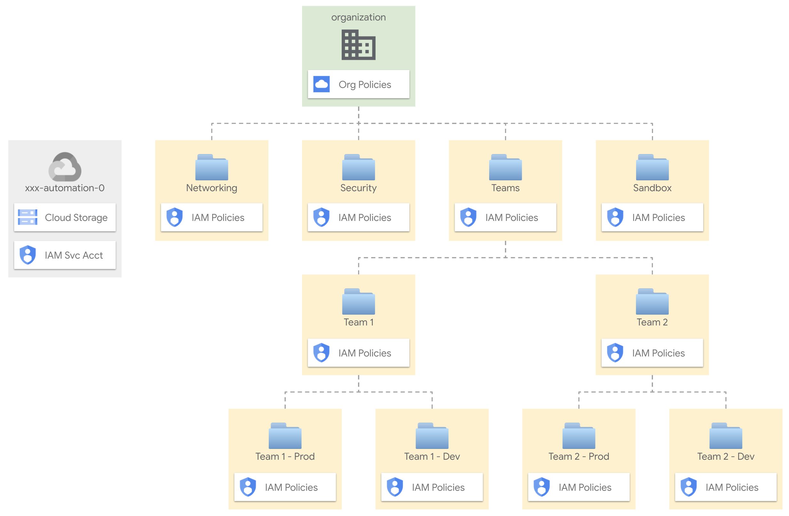

# Resource hierarchy

This stage performs two important tasks:

- create the top-level hierarchy of folders, and the associated resources used later on to automate each part of the hierarchy (eg. Networking)
- set organization policies on the organization, and any exception required on specific folders

  

## Design overview and choices

Despite its simplicity, this stage implements the basics of a design that we've seen working well for a variety of customers, where the hierarchy is laid out following two conceptually different approaches:

- core or shared resources are grouped in hierarchy branches that map to their type or purpose (e.g. Networking)
- team or application resources are grouped in lower level hierarchy branches that map to management or operational considerations (e.g. which team manages a set of applications, or owns a subset of company data, etc.)

This split approach usually represents well functional and operational patterns, where core resources are centrally managed by individual teams (e.g. networking, security, fleets of similar VMS, etc.), while teams need more granularity to access managed services used by the applications they maintain.

The approach also adapts to different high level requirements:

- it can be used either for single organizations containing multiple environments, or with multiple organizations dedicated to specific environments (e.g. prod/nonprod), as the environment split is implemented at the project or lower folder level
- it adapts to complex scenarios, with different countries or corporate entities using the same GCP organization, as core services are typically shared, and/or an extra layer on top can be used as a drop-in to implement the country/entity separation
