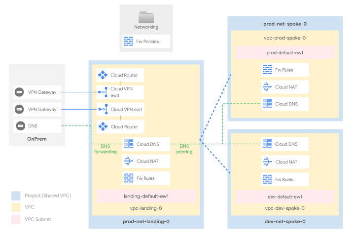

# Networking with VPC Peering

This stage sets up the shared network infrastructure for the whole organization. It adopts the common “hub and spoke” reference design, which is well suited to multiple scenarios, and offers several advantages versus other designs:

- the “hub” VPC centralizes external connectivity to on-prem or other cloud environments, and is ready to host cross-environment services like CI/CD, code repositories, and monitoring probes
- the “spoke” VPCs allow partitioning workloads while still retaining controlled access to central connectivity and services
- Shared VPC in both hub and spokes splits management of network resources in specific (host) projects, while still allowing them to be consumed from workload (service) projects
- the design also lends itself to easy DNS centralization, both from on-prem to cloud and from cloud to on-prem

Connectivity between hub and spokes is established here via [VPC Peering](https://cloud.google.com/vpc/docs/vpc-peering), which offers a complete isolation between environments, and no choke-points in the data plane. Different ways of implementing connectivity, and their respective pros and cons, are discussed below.

The following diagram illustrates the high-level design, and should be used as a reference for the following sections. The final number of subnets, and their IP addressing design will of course depend on customer-specific requirements, and can be easily changed via variables or external data files without having to edit the actual code.

  

## Design overview and choices

### VPC design

The hub/landing VPC hosts external connectivity and shared services for spoke VPCs, which are connected to it via VPC peering. Spokes are used here to partition environments, which is a fairly common pattern:

- one spoke VPC for the production environment
- one spoke VPC for the development environment

Each VPC is created into its own project, and each project is configured as a Shared VPC host, so that network-related resources and access configurations via IAM are kept separate for each VPC.

### External connectivity

External connectivity to on-prem is implemented here via HA VPN (two tunnels per region), as this is the minimum common denominator often used directly, or as a stop-gap solution to validate routing and transfer data, while waiting for [interconnects](https://cloud.google.com/network-connectivity/docs/interconnect) to be provisioned.

Connectivity to additional on-prem sites or other cloud providers should be implemented in a similar fashion, via VPN tunnels or interconnects in the landing VPC sharing the same regional router.

### Internal connectivity

Each environment has full line of sight with the Landing VPC, and hence with any networks interconnected with it (e.g. your onprem environment). Environments cannot communicate with each other (prod to dev and viceversa). If this is a requirement, and according to your specific needs and constraints, solutions based on full-mesh peerings, VPNs or NVA should be added to this design.

As mentioned initially, there are of course other ways to implement internal connectivity other than VPC peering. These can be easily retrofitted with minimal code changes, but introduce additional considerations for service interoperability, quotas and management.

This is a summary of the main options:

- [HA VPN](https://cloud.google.com/network-connectivity/docs/vpn/concepts/topologies) (implemented by [2-networking-vpn](../2-networking-b-vpn/))
  - Pros: simple compatibility with GCP services that leverage peering internally, better control on routes, avoids peering groups shared quotas and limits
  - Cons: additional cost, marginal increase in latency, requires multiple tunnels for full bandwidth
- [VPC Peering](https://cloud.google.com/vpc/docs/vpc-peering) (implemented here)
  - Pros: no additional costs, full bandwidth with no configurations, no extra latency, total environment isolation
  - Cons: no transitivity (e.g. to GKE masters, Cloud SQL, etc.), no selective exchange of routes, several quotas and limits shared between VPCs in a peering group
- [Multi-NIC appliances](https://cloud.google.com/architecture/best-practices-vpc-design#multi-nic) (implemented by [2-networking-nva](../2-networking-c-nva/))
  - Pros: additional security features (e.g. IPS), potentially better integration with on-prem systems by using the same vendor
  - Cons: complex HA/failover setup, limited by VM bandwidth and scale, additional costs for VMs and licenses, out of band management of a critical cloud component

### Internet egress

The path of least resistance for Internet egress is using Cloud NAT, and that is what's implemented in this setup, with a NAT gateway configured for each VPC.

Several other scenarios are possible of course, with varying degrees of complexity:

- a forward proxy, with optional URL filters
- a default route to on-prem to leverage existing egress infrastructure
- a full-fledged perimeter firewall to control egress and implement additional security features like IPS

Future pluggable modules will allow to easily experiment, or deploy the above scenarios.

### VPC and Hierarchical Firewall

The GCP Firewall is a stateful, distributed feature that allows the creation of L4 policies, either via VPC-level rules or more recently via hierarchical policies applied on the resource hierarchy (organization, folders).

The current setup adopts both firewall types, and uses hierarchical rules on the Networking folder for common ingress rules (egress is open by default), e.g. from health check or IAP forwarders ranges, and VPC rules for the environment or workload-level ingress.

Rules and policies are defined in simple YAML files, described below.

### DNS

DNS goes hand in hand with networking, especially on GCP where Cloud DNS zones and policies are associated at the VPC level. This setup implements both DNS flows:

- on-prem to cloud via private zones for cloud-managed domains, and an [inbound policy](https://cloud.google.com/dns/docs/server-policies-overview#dns-server-policy-in) used as forwarding target or via delegation (requires some extra configuration) from on-prem DNS resolvers
- cloud to on-prem via forwarding zones for the on-prem managed domains

DNS configuration is further centralized by leveraging peering zones, so that

- the hub/landing Cloud DNS hosts configurations for on-prem forwarding, Google API domains, and the top-level private zone/s (e.g. gcp.example.com)
- the spokes Cloud DNS host configurations for the environment-specific domains (e.g. prod.gcp.example.com), which are bound to the hub/landing leveraging [cross-project binding](https://cloud.google.com/dns/docs/zones/zones-overview#cross-project_binding); a peering zone for the `.` (root) zone is then created on each spoke, delegating all DNS resolution to hub/landing.
- Private Google Access is enabled for a selection of the [supported domains](https://cloud.google.com/vpc/docs/configure-private-google-access#domain-options), namely
  - `private.googleapis.com`
  - `restricted.googleapis.com`
  - `gcr.io`
  - `packages.cloud.google.com`
  - `pkg.dev`
  - `pki.goog`

To complete the configuration, the 35.199.192.0/19 range should be routed on the VPN tunnels from on-prem, and the following names configured for DNS forwarding to cloud:

- `private.googleapis.com`
- `restricted.googleapis.com`
- `gcp.example.com` (used as a placeholder)

From cloud, the `example.com` domain (used as a placeholder) is forwarded to on-prem.

This configuration is battle-tested, and flexible enough to lend itself to simple modifications without subverting its design, for example by forwarding and peering root zones to bypass Cloud DNS external resolution.